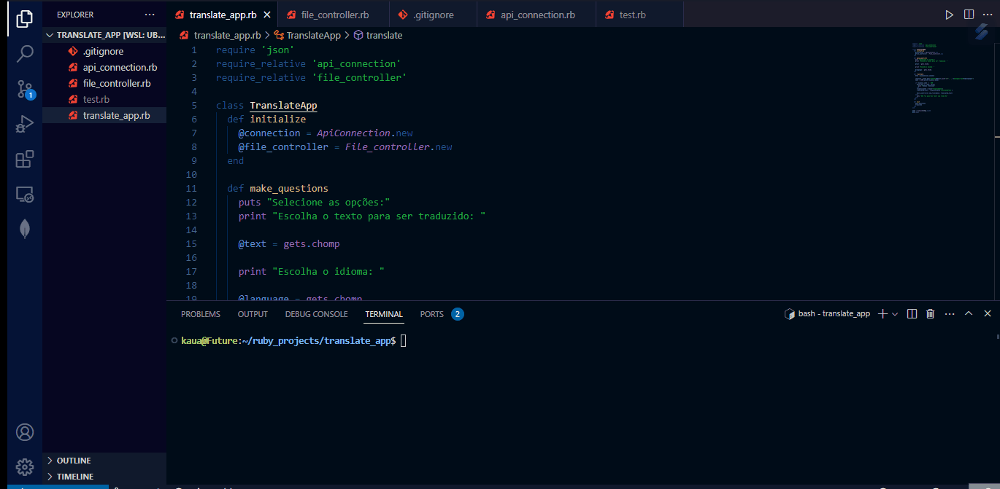

<h1 align="center">Translate App</h1>

Uma pequena aplicação onde retorna uma frase no idioma selecionado

## Features ✨
 

- [x] Conexão com API externa de tradução
- [x] Criação de arquivo com a tradução

 

<h1 align="center">
    
</h1>

## Tecnologias

- [Ruby](https://www.ruby-lang.org/pt/)

---

Obrigado a atenção de quem veio até aqui 🧡 | [Linkedin](https://www.linkedin.com/in/kau%C3%A3-borba-390946235/) 